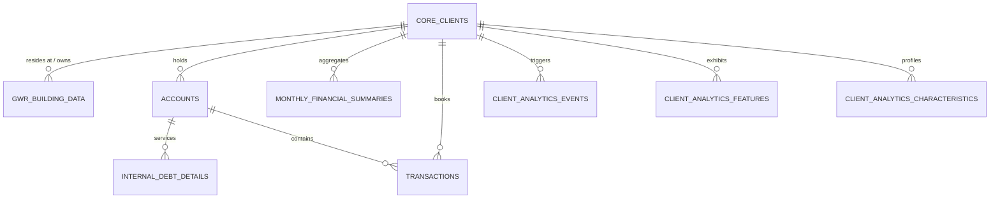

# Swiss Cantonal Bank Database & Agent Query Guide
## High-Performance Intelligence Catalog for Relationship Managers & AI Agents

This guide documents the SQLite database (`data/nba_marketplace.db`) backing the **Swiss Cantonal Bank Agentic Next Best Action (NBA) Marketplace**. It is specifically engineered to empower AI agents and backend engines to instantly translate natural language requests from Cantonal Bank Relationship Managers (RMs) into high-precision, sub-millisecond SQL queries.

---

## 1. Executive Summary & Data Scale

- **Database Path**: `data/nba_marketplace.db`
- **Total Clients (`core_clients`)**: **20,000 active Swiss client profiles** across all 26 Swiss cantons.
- **Monthly Financial Summaries (`monthly_financial_summaries`)**: **240,000 records** spanning 12 rolling months (`2025-09` through `2026-08`).
- **Granular Transactions (`transactions`)**: 240,000+ representative booking entries with enriched category and merchant metadata.
- **Analytics Events, Features & Characteristics**: 125,000+ Contovista Enrichment Engine records (`CV_EE_OUT_USR_EVT`, `CV_EE_OUT_USR_FEAT`, `CV_EE_OUT_USR_CHR`).
- **Benchmark Performance**: Sub-millisecond execution speeds for complex joins across demographics, buildings, cash flows, and debt profiles.

---

## 2. Complete Relational Database Schema



### 2.1 Table: `core_clients`
Primary master table for individual banking clients.
- **`user_id`** (`TEXT`, PRIMARY KEY): Unique client identifier in format `CH-USR-XXXXXX` (e.g. `CH-USR-001830`).
- **`last_name`** (`TEXT`): Client surname (e.g. *Müller, Favre, Bernasconi, Keller*).
- **`first_name`** (`TEXT`): Client given name (e.g. *Martin, Céline, Matteo, Anna*).
- **`birth_date`** (`TEXT`): Date of birth (`YYYY-MM-DD`). Derive exact age and retirement eligibility from this field.
- **`gender`** (`TEXT`): `'M'` or `'F'`.
- **`nationality`** (`TEXT`): ISO 2-letter country code (82% `'CH'`, alongside `'DE'`, `'IT'`, `'FR'`, `'PT'`, etc.).
- **`canton`** (`TEXT`): 2-letter Swiss canton code (`ZH`, `BE`, `VD`, `AG`, `SG`, `LU`, `GE`, `BS`, `BL`, `TI`, `VS`, `ZG`, etc.).
- **`marital_status`** (`TEXT`): `'SINGLE'`, `'MARRIED'`, `'DIVORCED'`, or `'WIDOWED'`.
- **`address`** (`TEXT`): Street name and house number (e.g. *Bahnhofstrasse 42*).
- **`city_zip`** (`TEXT`): Swiss postal code and municipality name (e.g. *8001 Zürich*, *3011 Bern*, *1003 Lausanne*).

---

### 2.2 Table: `gwr_building_data`
Swiss Federal Register of Buildings and Dwellings (Eidgenössisches Gebäude- und Wohnungsregister - GWR). Key for real estate, eco-renovations, and pre-2028 heating replacement campaigns.
- **`address_id`** (`TEXT`, PRIMARY KEY): GWR building identifier `GWR-ADDR-XXXXXX`.
- **`user_id`** (`TEXT`, FK -> `core_clients.user_id`): Associated client.
- **`street_address`** (`TEXT`): Street and house number.
- **`zip_code`** (`TEXT`): 4-digit Swiss postal code.
- **`build_year`** (`INTEGER`): Construction year (e.g. 1955 to 2024).
- **`heat_generator`** (`TEXT`): Heating technology installed:
  - `'Oil Heating'` *(Heizöl - Fossil)*
  - `'Gas'` *(Erdgas - Fossil)*
  - `'Heat Pump'` *(Wärmepumpe / Geothermie - Renewable)*
  - `'District Heating'` *(Fernwärme - Thermal Grid)*
  - `'Wood/Pellet'` *(Holzpellets - Renewable)*
  - `'Electric'` *(Elektrospeicherheizung)*
- **`energy_source`** (`TEXT`): Exact energy carrier (e.g. *Heating Oil, Natural Gas, Geothermal / Air-Water Heat Pump, District Thermal Grid*).
- **`gwr_verified`** (`INTEGER`): Official registry verification flag (`1` = verified, `0` = unverified).

> [!IMPORTANT]
> **Pre-2028 Renovation Target**: Exactly **15.0%** of all clients reside in properties with `heat_generator IN ('Oil Heating', 'Gas')` AND `build_year < 2010`. These are prime leads for green renovation mortgage campaigns.

---

### 2.3 Table: `accounts`
Core DWH bank accounts table (`ee_v2_account`).
- **`acc_id`** (`TEXT`, PRIMARY KEY): Account identifier (e.g. `ACC-CHK-000001`, `ACC-SAV-000001`, `ACC-P3A-000001`, `ACC-MRT-000001`).
- **`usr_id`** (`TEXT`, FK -> `core_clients.user_id`): Client owner.
- **`iban`** (`TEXT`, UNIQUE): Swiss IBAN (e.g. `CH930076200000101`).
- **`type`** (`TEXT`): Banking product type:
  - `'CURRENT'`: Transactional checking account (Privatkonto / Zahlungskonto).
  - `'SAVING'`: Savings account (Sparkonto / Ansparkonto).
  - `'PILLAR 3A'`: Tax-advantaged retirement account (Vorsorgekonto Sparen 3a).
  - `'MORTGAGE'`: Internal bank mortgage loan account (Hypothekarkonto).
- **`cv_type`** (`TEXT`): Contovista canonical type (`CURRENT_ACCOUNT`, `SAVINGS_ACCOUNT`, `PILLAR_3A_ACCOUNT`, `MORTGAGE_ACCOUNT`).
- **`usage`** (`TEXT`): Default `'PERSONAL'`.
- **`curr`** (`TEXT`): Currency (`'CHF'`).
- **`is_joint`** (`INTEGER`): Joint account flag (`1` = partner/spouse joint, `0` = individual).

---

### 2.4 Table: `internal_debt_details`
Details on active internal Cantonal Bank mortgages and consumer financing.
- **`detail_id`** (`TEXT`, PRIMARY KEY): Debt contract ID `DBT-MRT-XXXXXX`.
- **`account_id`** (`TEXT`, FK -> `accounts.acc_id`): Linked mortgage account.
- **`user_id`** (`TEXT`, FK -> `core_clients.user_id`): Borrowing client.
- **`debt_type`** (`TEXT`): Debt category (`'MORTGAGE'`, `'PERSONAL_LOAN'`).
- **`original_principal`** (`REAL`): Initial loan principal disbursed in CHF (e.g. 500,000 to 1,400,000 CHF).
- **`remaining_balance`** (`REAL`): Outstanding balance in CHF.
- **`interest_rate_pct`** (`REAL`): Annual interest rate (e.g. `1.35`% to `1.95`% for Fixed, `1.10`% to `1.55`% for SARON).
- **`rate_type`** (`TEXT`): Rate structure (`'FIXED'` or `'SARON'`).
- **`start_date`** (`TEXT`): Contract origination date (`YYYY-MM-DD`).
- **`maturity_date`** (`TEXT`): Contract expiration/rollover date (`YYYY-MM-DD`).
- **`monthly_installment`** (`REAL`): Total monthly payment (Interest + Amortisation) in CHF.

---

### 2.5 Table: `monthly_financial_summaries`
The high-speed rolling financial engine. Stores 12 historical monthly snapshots (`2025-09` to `2026-08`) per user.
- **`summary_id`** (`TEXT`, PRIMARY KEY): Format `SUM-XXXXXX-MM` (e.g. `SUM-000001-12`).
- **`user_id`** (`TEXT`, FK -> `core_clients.user_id`): Client.
- **`year_month`** (`TEXT`): Period formatted as `YYYY-MM` (`2025-09` through `2026-08`). **Latest month is always `'2026-08'`**.
- **`monthly_income`** (`REAL`): Total monthly cash inflows in CHF.
- **`monthly_expense`** (`REAL`): Total monthly cash outflows in CHF.
- **`income_by_cat_json`** (`TEXT`): JSON key-value map of Level 3 income categories to CHF amounts:
  ```json
  {"regular_wage_credit": 8500.00, "irregular_wage_credit": 3000.00, "capital_income": 120.50}
  ```
- **`spending_by_cat_json`** (`TEXT`): JSON key-value map of Level 3 spending categories to CHF amounts:
  ```json
  {"mortgage": 2450.00, "health_insurance": 450.00, "supermarket": 850.00, "saving": 588.00}
  ```
- **`spending_by_cp_cat_json`** (`TEXT`): JSON map of spending by Counterparty Category:
  ```json
  {"professional_service_provider.financial.financial_institution": 2450.00, "shop.food_beverages": 850.00}
  ```
- **`ending_checking_balance`** (`REAL`): Liquid cash balance in primary checking account at month-end.
- **`ending_savings_balance`** (`REAL`): Liquid savings buffer at month-end.
- **`ending_pillar3a_balance`** (`REAL`): Cumulative balance invested/held in Pillar 3a.
- **`internal_mortgage_balance`** (`REAL`): Remaining balance on internal mortgages (`0.0` if no internal mortgage).

> [!TIP]
> **Strict Reconciliations Guaranteed**:
> `monthly_income == sum(income_by_cat_json.values())`
> `monthly_expense == sum(spending_by_cat_json.values())`
> Balance roll-forwards continuously reconcile over all 12 rolling months.

---

### 2.6 Table: `transactions`
Granular ledger entries (`ee_v2_transaction`).
- **`trx_id`** (`TEXT`, PRIMARY KEY): Transaction ID `TRX-XXXXXX-MM-NN`.
- **`acc_id`** (`TEXT`, FK -> `accounts.acc_id`): Account debited/credited.
- **`usr_id`** (`TEXT`, FK -> `core_clients.user_id`): Client.
- **`book_date`** / **`val_date`** (`TEXT`): Booking and value dates (`YYYY-MM-DD`).
- **`amount`** (`REAL`): Transaction amount (Positive for Inflow, Negative for Outflow).
- **`cv_cat`** (`TEXT`): Level 3 EE Category code (e.g. `regular_wage_credit`, `mortgage`, `supermarket`, `health_insurance`).
- **`cv_cp_cat`** (`TEXT`): Hierarchical counterparty category (e.g. `shop.food_beverages`, `healthcare.health_insurance`).
- **`cp_name`** (`TEXT`): Counterparty or merchant business name (e.g. *UBS AG, Migros Supermarkt, Helsana, Digitec Galaxus AG*).
- **`cv_merch_uuid`** (`TEXT`): Canonical merchant UUID for merchant aggregation.

---

### 2.7 Table: `client_analytics_events` (`CV_EE_OUT_USR_EVT`)
Life event triggers detected by Contovista behavioral pattern engines.
- **`event_uuid`** (`TEXT`, PRIMARY KEY): UUID.
- **`user_id`** (`TEXT`, FK -> `core_clients.user_id`): Client.
- **`event_type`** (`TEXT`): One of the standard life events:
  - `'HERITAGE'`: Major inheritance lump sum credited (> CHF 15,000 to CHF 250,000).
  - `'START_OF_PENSION'`: Retirement transition, first AHV/pension fund credits.
  - `'NEW_EMPLOYER'`: Detected switch in monthly wage payer.
  - `'SALARY_CHANGE'`: Significant increase/decrease in recurring wage (> 5%).
  - `'UNUSUALLY_HIGH_SALARY_PAYMENT'`: 13th month salary in Dec or annual performance bonus in March.
  - `'NEW_DIRECT_DEBIT'`: Newly authorized LSV / eBill standing payment.
- **`event_date`** (`TEXT`): Date event was detected (`YYYY-MM-DD`).
- **`new_amount`** (`REAL`): Amount associated with the event (e.g. inheritance sum or new salary level).
- **`currency`** (`TEXT`): Currency (`CHF`).
- **`counterparty_name`** (`TEXT`): Triggering institution or counterparty.

---

### 2.8 Table: `client_analytics_features` (`CV_EE_OUT_USR_FEAT`)
Detected recurring financial obligations and competitive banking relationships.
- **`feat_uuid`** (`TEXT`, PRIMARY KEY): UUID.
- **`user_id`** (`TEXT`, FK -> `core_clients.user_id`): Client.
- **`feature_type`** (`TEXT`): Financial feature:
  - `'ANNUAL_SALARY'`: Base annualized salary.
  - `'ANNUAL_BONUS_AND_EXTRA_PAY'`: Cumulative 12-month bonuses/extra pay.
  - `'MORTGAGE'`: **External Mortgage obligation** paid to competitor institutions.
  - `'RENT'`: Rental obligation paid to property management companies.
  - `'THIRD_PARTY_ACCOUNT'`: Detected transfers to competitor banks, neo-banks (Revolut, Neon), or crypto brokers.
  - `'LEASING'`: Car leasing obligations.
  - `'LOAN'`: Consumer loans with external banks.
- **`discriminator`** (`TEXT`): Competitor bank, landlord, or financial institution name (e.g. *UBS AG, Raiffeisen Schweiz, AMAG Leasing, Revolut Ltd, Wincasa AG*).
- **`credit_amount`** (`REAL`): 12-month total inflow associated with this feature.
- **`debit_amount`** (`REAL`): 12-month total outflow associated with this feature (e.g. annual external mortgage debt service).
- **`debit_category`** / **`credit_category`** (`TEXT`): Level 3 EE category code.

---

### 2.9 Table: `client_analytics_characteristics` (`CV_EE_OUT_USR_CHR`)
Customer behavioral traits, digital engagement, and lifestyle affinities.
- **`chr_uuid`** (`TEXT`, PRIMARY KEY): UUID.
- **`user_id`** (`TEXT`, FK -> `core_clients.user_id`): Client.
- **`characteristic_type`** (`TEXT`):
  - `'CREDIT_CARD_USER'`: Active credit card usage flag and issuers.
  - `'DIGITAL_AFFINITY'`: Digital banking, Twint, and online merchant engagement score.
  - `'FREQUENT_TRAVELER'`: High holiday, airline, and hotel spending.
  - `'SUSTAINABILITY'`: Affinity for ESG funds, organic retailers (Alnatura), and green mobility.
  - `'PERSONAL_LOAN_USER'`: Active consumer credit utilization.
- **`characteristic_value`** (`TEXT`): JSON payload with detailed indicators (e.g. `{"active": true, "score": 94.5}`).
- **`trx_count`** (`INTEGER`): Transaction frequency driving the characteristic.

---

## 3. Comprehensive Category Taxonomy & Counterparties

### 3.1 Income Categories (Level 3 `cv_cat`)
| Category Code | Meaning / Description | Standard Payer / Counterparty |
| :--- | :--- | :--- |
| `regular_wage_credit` | Monthly base employment salary | Swiss employers (Novartis, Swisscom, Roche, ABB, SBB, etc.) |
| `irregular_wage_credit` | 13th month salary, bonuses, extra compensation | Employer payroll |
| `pension_credit` | Pillar 2 occupational pension (BVG / Pensionskasse) | Pensionskasse Schweiz, AHV Ausgleichskasse |
| `old_age_survivor_insurance` | Pillar 1 state retirement pension (AHV) | SVA / Eidgenössische Ausgleichskasse |
| `heritage_credit` | Inheritance payments, estate distributions | Erbschaftsamt, Notariat |
| `capital_income` | Stock dividends, fund distributions, capital yields | Investment accounts, depots |
| `family_benefit` | Cantonal child and family allowances (Kinderzulagen) | Cantonal compensation offices |
| `account_interest` | Interest earned on savings or deposit accounts | Bank interest credit |

---

### 3.2 Expense Categories (Level 3 `cv_cat`)
| Category Code | Meaning / Description | Typical Counterparty Domain |
| :--- | :--- | :--- |
| `mortgage` | Mortgage interest and amortisation payments | Competitor Banks (`UBS AG`, `Raiffeisen`, `PostFinance`, `Valiant`) |
| `rent_payment` | Residential apartment or home rent | Property Managers (`Wincasa AG`, `Livit AG`, `PSP Swiss Property`) |
| `health_insurance` | Mandatory basic & supplementary health insurance (KVG/VVG) | Insurers (`Helsana`, `CSS`, `Swica`, `Sanitas`, `Visana`, `Concordia`) |
| `supermarket` | Food, groceries, household items | Retailers (`Migros`, `Coop`, `Denner`, `Aldi`, `Lidl`, `Alnatura`) |
| `telecommunication` | Mobile, home internet, TV subscriptions | Telecom (`Swisscom`, `Sunrise`, `Salt`) |
| `electricity_gas_heating` | Household utilities, electricity, gas | Utilities (`EWZ`, `BKW`, `Romande Energie`, `IWB`) |
| `public_transport` | Train tickets, GA/Halbtax travelcards, local transit | Transit (`SBB CFF FFS`, `ZVV`, `Bernmobil`, `TPG`) |
| `petrol_station` | Fuel, gas station shops | Fuel (`Avia`, `Coop Pronto`, `Shell`, `Migrol`) |
| `saving` | Pillar 3a contributions, recurring investment plans | 3a Providers (`Frankly`, `VIAC`, `Finpension`, `Cantonal Bank 3a`) |
| `restaurant` | Dining out, restaurants, cafes | Gastronomy (`Bindella`, `Tibits`, `Pizzeria Molino`, `Starbucks`) |
| `clothing` | Fashion, shoes, apparel | Retail (`Zalando`, `Manor`, `H&M`, `Zara`) |
| `electronics_shop_other` | Computers, phones, consumer tech | Tech Retailers (`Digitec Galaxus AG`, `Apple`, `MediaMarkt`) |
| `hotel` / `airline` | Vacation lodging, flight bookings | Travel (`SWISS Air Lines`, `Booking.com`, `Hotelplan`, `Kuoni`) |
| `car_leasing` | Vehicle leasing monthly rate | Leasing Providers (`AMAG Leasing AG`, `BMW Financial Services`) |
| `personal_loan` | Consumer credit installment | Consumer Banks (`Cembra Money Bank AG`, `Bank-now AG`) |
| `tax_payment` | Cantonal & municipal direct income taxes | Cantonal Tax Administration (`Kantonales Steueramt`) |

---

### 3.3 Major Competitor Banks & Third-Party Discriminators
When scanning `client_analytics_features` or transaction counterparty names:
- **Major Universal Banks**: `UBS AG`, `Credit Suisse (Schweiz) AG`, `Raiffeisen Schweiz`, `PostFinance AG`, `Migros Bank AG`, `Valiant Bank AG`, `Bank Cler AG`.
- **Digital / Neo-Banks**: `Neon / Hypothekarbank Lenzburg`, `Revolut Ltd`, `Wise Europe`, `Yuh`.
- **Brokers & Crypto Providers**: `Swissquote Bank AG`, `Bitcoin Suisse AG`.
- **Consumer Lenders & Leasers**: `Cembra Money Bank AG`, `Bank-now AG`, `AMAG Leasing AG`.
- **Digital 3a Apps**: `VIAC Vorsorgestiftung 3a`, `Frankly (ZKB)`, `Finpension 3a`.

---

## 4. Relationship Manager Query Playbook (Top 10 Templates)

Below are production-tested SQL templates that agents can invoke directly or adapt dynamically based on RM prompts.

### Query 1: Pre-2028 Green Renovation Eco-Mortgage Prospects
> **RM Request**: *"Find clients owning older homes (built before 2010) with fossil oil or gas heating in Canton Zurich or Bern who have over CHF 30,000 in savings, so we can offer our Eco-Renovation Loan."*

```sql
SELECT 
    c.user_id,
    c.first_name || ' ' || c.last_name AS client_name,
    c.canton,
    c.address || ', ' || c.city_zip AS property_location,
    g.build_year,
    g.heat_generator,
    g.energy_source,
    s.ending_savings_balance,
    s.monthly_income
FROM core_clients c
JOIN gwr_building_data g ON c.user_id = g.user_id
JOIN monthly_financial_summaries s ON c.user_id = s.user_id AND s.year_month = '2026-08'
WHERE g.heat_generator IN ('Oil Heating', 'Gas')
  AND g.build_year < 2010
  AND c.canton IN ('ZH', 'BE')
  AND s.ending_savings_balance >= 30000
ORDER BY s.ending_savings_balance DESC
LIMIT 50;
```

---

### Query 2: External Mortgage Refinancing Leads (Competitor Churn)
> **RM Request**: *"Show me high-income clients who are currently paying external mortgages to UBS or Raiffeisen with more than CHF 20k/year in payments."*

```sql
SELECT 
    c.user_id,
    c.first_name || ' ' || c.last_name AS client_name,
    c.canton,
    f.discriminator AS competitor_bank,
    f.debit_amount AS annual_mortgage_outflow_chf,
    s.monthly_income,
    s.ending_savings_balance
FROM core_clients c
JOIN client_analytics_features f ON c.user_id = f.user_id
JOIN monthly_financial_summaries s ON c.user_id = s.user_id AND s.year_month = '2026-08'
WHERE f.feature_type = 'MORTGAGE'
  AND (f.discriminator LIKE '%UBS%' OR f.discriminator LIKE '%Raiffeisen%')
  AND f.debit_amount >= 20000
ORDER BY f.debit_amount DESC
LIMIT 50;
```

---

### Query 3: Pillar 3a Tax-Optimization Candidates (High Income + Gap)
> **RM Request**: *"Give me clients earning over CHF 8,000/month who have high cash in checking (> CHF 15k) but have not maxed out their Pillar 3a (contributed < CHF 7,056 this year)."*

```sql
SELECT 
    c.user_id,
    c.first_name || ' ' || c.last_name AS client_name,
    s.monthly_income,
    s.ending_checking_balance,
    s.ending_savings_balance,
    COALESCE(ROUND(SUM(json_extract(m.spending_by_cat_json, '$.saving')), 2), 0.0) AS annual_3a_contributed_chf,
    ROUND(7056.0 - COALESCE(SUM(json_extract(m.spending_by_cat_json, '$.saving')), 0.0), 2) AS remaining_3a_tax_gap_chf
FROM core_clients c
JOIN monthly_financial_summaries s ON c.user_id = s.user_id AND s.year_month = '2026-08'
LEFT JOIN monthly_financial_summaries m ON c.user_id = m.user_id
WHERE s.monthly_income >= 8000
  AND s.ending_checking_balance >= 15000
GROUP BY c.user_id
HAVING annual_3a_contributed_chf < 7056.0
ORDER BY s.ending_checking_balance DESC
LIMIT 50;
```

---

### Query 4: Wealth Management Mandate Leads (Excess Cash Drag)
> **RM Request**: *"Identify clients with large uninvested liquidity (combined checking + savings > CHF 100,000) earning regular salaries who don't have internal mortgages."*

```sql
SELECT 
    c.user_id,
    c.first_name || ' ' || c.last_name AS client_name,
    c.canton,
    s.monthly_income,
    s.ending_checking_balance,
    s.ending_savings_balance,
    (s.ending_checking_balance + s.ending_savings_balance) AS total_idle_liquidity_chf
FROM core_clients c
JOIN monthly_financial_summaries s ON c.user_id = s.user_id AND s.year_month = '2026-08'
WHERE (s.ending_checking_balance + s.ending_savings_balance) >= 100000
  AND s.internal_mortgage_balance = 0.0
ORDER BY total_idle_liquidity_chf DESC
LIMIT 50;
```

---

### Query 5: Recent Inheritance Inflow (Wealth Management Trigger)
> **RM Request**: *"Alert me to clients who received an inheritance or estate distribution (> CHF 25,000) in the past 6 months."*

```sql
SELECT 
    c.user_id,
    c.first_name || ' ' || c.last_name AS client_name,
    c.canton,
    e.event_type,
    e.event_date,
    e.new_amount AS inheritance_amount_chf,
    e.counterparty_name,
    s.ending_savings_balance
FROM core_clients c
JOIN client_analytics_events e ON c.user_id = e.user_id
JOIN monthly_financial_summaries s ON c.user_id = s.user_id AND s.year_month = '2026-08'
WHERE e.event_type = 'HERITAGE'
  AND e.new_amount >= 25000
ORDER BY e.event_date DESC
LIMIT 50;
```

---

### Query 6: Expiring Internal Mortgages (Renewal Retention)
> **RM Request**: *"List clients with internal fixed mortgages that will mature within the next 24 months so we can lock in renewal rates."*

```sql
SELECT 
    c.user_id,
    c.first_name || ' ' || c.last_name AS client_name,
    d.debt_type,
    d.original_principal,
    d.remaining_balance,
    d.interest_rate_pct,
    d.rate_type,
    d.start_date,
    d.maturity_date,
    d.monthly_installment
FROM core_clients c
JOIN internal_debt_details d ON c.user_id = d.user_id
WHERE d.debt_type = 'MORTGAGE'
  AND d.rate_type = 'FIXED'
  AND d.maturity_date BETWEEN '2026-08-01' AND '2028-12-31'
ORDER BY d.maturity_date ASC;
```

---

### Query 7: Pre-Retirement Advisory Candidates (Age 58 - 64)
> **RM Request**: *"Find clients approaching retirement age (58 to 64 years old) with solid savings (> CHF 50k) for our comprehensive Pensionsberatung / retirement plan."*

```sql
SELECT 
    c.user_id,
    c.first_name || ' ' || c.last_name AS client_name,
    c.birth_date,
    (2026 - CAST(SUBSTR(c.birth_date, 1, 4) AS INTEGER)) AS current_age,
    s.monthly_income,
    s.ending_savings_balance,
    s.ending_pillar3a_balance,
    s.internal_mortgage_balance
FROM core_clients c
JOIN monthly_financial_summaries s ON c.user_id = s.user_id AND s.year_month = '2026-08'
WHERE (2026 - CAST(SUBSTR(c.birth_date, 1, 4) AS INTEGER)) BETWEEN 58 AND 64
  AND s.ending_savings_balance >= 50000
ORDER BY current_age DESC, s.ending_savings_balance DESC
LIMIT 50;
```

---

### Query 8: First-Time Homebuyer Prospects (Affluent Renters)
> **RM Request**: *"Find young affluent renters (age 28-45) with monthly salary > CHF 7,500 and savings > CHF 60,000 who currently pay over CHF 1,800/month in rent."*

```sql
SELECT 
    c.user_id,
    c.first_name || ' ' || c.last_name AS client_name,
    c.canton,
    (2026 - CAST(SUBSTR(c.birth_date, 1, 4) AS INTEGER)) AS age,
    s.monthly_income,
    s.ending_savings_balance,
    json_extract(s.spending_by_cat_json, '$.rent_payment') AS monthly_rent_paid_chf
FROM core_clients c
JOIN monthly_financial_summaries s ON c.user_id = s.user_id AND s.year_month = '2026-08'
WHERE (2026 - CAST(SUBSTR(c.birth_date, 1, 4) AS INTEGER)) BETWEEN 28 AND 45
  AND s.monthly_income >= 7500
  AND s.ending_savings_balance >= 60000
  AND json_extract(s.spending_by_cat_json, '$.rent_payment') >= 1800
ORDER BY s.ending_savings_balance DESC
LIMIT 50;
```

---

### Query 9: Neo-Bank & Crypto Outflow (Digital Product Cross-Sell)
> **RM Request**: *"Show clients who are transferring money to external neo-banks (Revolut, Neon) or crypto platforms so we can pitch our Cantonal Bank digital trading & cards."*

```sql
SELECT 
    c.user_id,
    c.first_name || ' ' || c.last_name AS client_name,
    f.discriminator AS external_provider,
    f.credit_amount AS total_inflow_chf,
    f.debit_amount AS total_outflow_chf,
    s.monthly_income,
    s.ending_checking_balance
FROM core_clients c
JOIN client_analytics_features f ON c.user_id = f.user_id
JOIN monthly_financial_summaries s ON c.user_id = s.user_id AND s.year_month = '2026-08'
WHERE f.feature_type = 'THIRD_PARTY_ACCOUNT'
  AND (f.discriminator LIKE '%Revolut%' 
       OR f.discriminator LIKE '%Neon%' 
       OR f.discriminator LIKE '%Crypto%' 
       OR f.discriminator LIKE '%Swissquote%')
ORDER BY f.debit_amount DESC
LIMIT 50;
```

---

### Query 10: Sustainable Investing Leads (ESG Affinity)
> **RM Request**: *"Find clients with high sustainability affinity who have over CHF 25k in savings for our Swisscanto ESG fund campaign."*

```sql
SELECT 
    c.user_id,
    c.first_name || ' ' || c.last_name AS client_name,
    c.canton,
    chr.characteristic_type,
    json_extract(chr.characteristic_value, '$.score') AS sustainability_score,
    s.ending_savings_balance,
    s.monthly_income
FROM core_clients c
JOIN client_analytics_characteristics chr ON c.user_id = chr.user_id
JOIN monthly_financial_summaries s ON c.user_id = s.user_id AND s.year_month = '2026-08'
WHERE chr.characteristic_type = 'SUSTAINABILITY'
  AND s.ending_savings_balance >= 25000
ORDER BY CAST(json_extract(chr.characteristic_value, '$.score') AS INTEGER) DESC
LIMIT 50;
```

---

## 5. Fast Query Guidelines for AI Agents

1. **Always Filter on `year_month = '2026-08'` for Latest Point-in-Time Balances**:
   `monthly_financial_summaries` holds 12 months. Unless doing a 12-month aggregate (e.g. `SUM(json_extract(...))`), always restrict the primary summary row to `s.year_month = '2026-08'`.
2. **Utilize SQLite `json_extract()` for Category Breakdowns**:
   - `json_extract(spending_by_cat_json, '$.mortgage')` -> Monthly mortgage spend.
   - `json_extract(spending_by_cat_json, '$.rent_payment')` -> Monthly rent paid.
   - `json_extract(spending_by_cat_json, '$.saving')` -> Monthly Pillar 3a deposit.
   - `json_extract(spending_by_cat_json, '$.health_insurance')` -> Health insurance cost.
   - `json_extract(income_by_cat_json, '$.regular_wage_credit')` -> Monthly base salary.
   - `json_extract(income_by_cat_json, '$.irregular_wage_credit')` -> Bonus / 13th month salary.
3. **Take Advantage of Compound Indexes**:
   - `idx_clients_canton_uid`: `core_clients(canton, user_id)`
   - `idx_gwr_heat_year`: `gwr_building_data(heat_generator, build_year, user_id)`
   - `idx_summaries_user_month`: `monthly_financial_summaries(user_id, year_month)`
   - `idx_feat_user_type`: `client_analytics_features(user_id, feature_type)`
   - `idx_feat_type_disc`: `client_analytics_features(feature_type, discriminator)`
   - `idx_evt_user_type_date`: `client_analytics_events(user_id, event_type, event_date)`
   - `idx_debt_user_type`: `internal_debt_details(user_id, debt_type)`
