# Challenge Data: Database & Agent Query Guide
## The 8 hackathon CSV files, rebuilt on the model of `DATABASE_AGENT_GUIDE.md`

This guide documents the SQLite database `data/nba_marketplace_real.db`, built from the eight challenge
CSV files (`individual`, `individual_state`, `account`, `account_balance`, `employer`, `event`, `transaction`,
`interaction`). It follows the structure and table names of `DATABASE_AGENT_GUIDE.md` wherever the data
allows. Where it does not, the difference is stated. Information the original schema has no place for gets
tables of its own.

**Every figure in this guide was computed on the database, and every SQL block below is executed by
`scripts/check_guide_queries.py`.** Timings were measured on a laptop, first run, cold cache.

> [!IMPORTANT]
> **Read before querying**
> 1. **Calendar is inferred.** The source counts months as integers (`period` 24289..24301). The database
>    maps them as `period = 12 × year + month`, so 24289 = `2024-01` and 24301 = `2025-01`. Three facts
>    support this reading. Every 13th salary falls in `2024-12`. Every annual bonus falls in `2024-03`, as the
>    original guide describes. And 364 agent-generated 3a payments are labelled *"Maximalbetrag 2024"*.
>    The organisers have not confirmed it. The source `period` is kept in every table.
> 2. **The people are synthetic, the addresses are real.** 8,005 of the 8,010 client addresses match a
>    building of the federal register (GWR). Names and addresses therefore live in `client_pii` only.
>    Do not publish that table, and do not give it to an agent that does not need it.
> 3. **Counterparties are partly anonymous.** Merchants are named, and so are one-off payers
>    (notaries, family members). Employers, landlords and mortgage lenders are not.
> 4. **Health and personality data are sensitive** (`client_health`, `client_profile`, `client_interests`).
>    Health data is special-category personal data under the Swiss FADP. Keep it out of marketing
>    triggers.
> 5. **Some records were written by LLM agents** in the source simulation. `transactions.decision_by`
>    says which ones (see Example G).

---

## 1. Executive Summary & Data Scale

| Item | Value |
|---|---|
| Database | `data/nba_marketplace_real.db`, SQLite, 1,596 MB, 29 tables |
| Clients (`core_clients`) | **8,046**, of whom 7,684 active (`is_active = 1`); 362 left the bank (death or churn) |
| Cantons | all 26 |
| Months of flows (`monthly_financial_summaries`) | **96,120 rows** = 8,010 clients × 12 months, `2024-02` → `2025-01` (latest month: `'2025-01'`) |
| Ledger (`transactions`) | **2,386,461 rows**: the full ledger, `2024-01-01` → `2025-01-30`, with merchant names from the source events |
| Accounts | 22,204, 7 product families, 119 product names |
| Contovista-style outputs | 13,638 events · 20,177 features · 41,037 characteristics |
| Buildings (`gwr_building_data`) | 8,005 clients linked to 5,994 distinct GWR buildings (EGID) |
| Guarantees (checked at build) | every CSV row present; monthly totals = sum of their category JSON; rebuilt month-end balances = `account_balance.csv` for all 22,204 accounts |

Build it yourself (the CSVs go in `data/`):

```bash
uv run python scripts/gwr_lookup.py                       # ~20 min, 6,001 addresses, 5 req/s, cached in data/gwr_cache.jsonl
uv run --with duckdb python scripts/build_marketplace_db.py   # ~6 min
python scripts/check_guide_queries.py                     # runs every SQL block of this guide
```

---

## 2. Relational Database Schema

```mermaid
erDiagram
    CORE_CLIENTS ||--|| CLIENT_PII : "identity (restricted)"
    CORE_CLIENTS ||--|| GWR_BUILDING_DATA : "lives at"
    CORE_CLIENTS ||--o{ ACCOUNTS : "holds"
    CORE_CLIENTS ||--o{ MONTHLY_FINANCIAL_SUMMARIES : "aggregates"
    CORE_CLIENTS ||--o{ TRANSACTIONS : "books"
    CORE_CLIENTS ||--o{ CLIENT_ANALYTICS_EVENTS : "triggers"
    CORE_CLIENTS ||--o{ CLIENT_ANALYTICS_FEATURES : "exhibits"
    CORE_CLIENTS ||--o{ CLIENT_ANALYTICS_CHARACTERISTICS : "profiles"
    CORE_CLIENTS ||--o{ DEBT_DETAILS : "owes"
    CORE_CLIENTS ||--o{ CLIENT_LIFE_EVENTS : "lives"
    CORE_CLIENTS ||--o{ CLIENT_RELATIONSHIPS : "relates to"
    CORE_CLIENTS ||--o| CLIENT_OUTCOMES : "joins / leaves"
    CORE_CLIENTS ||--|| CLIENT_PROFILE : "personality"
    CORE_CLIENTS ||--|| CLIENT_HEALTH : "health (sensitive)"
    CORE_CLIENTS ||--|| CLIENT_HOUSING : "housing"
    CORE_CLIENTS ||--o{ CLIENT_INTERESTS : "interests"
    CORE_CLIENTS ||--o{ CLIENT_DECLARED_PRODUCTS : "declares"
    CORE_CLIENTS }o--o| EMPLOYERS : "works for"
    ACCOUNTS ||--|| ACCOUNT_BALANCES : "closing balance"
    ACCOUNTS ||--o{ ACCOUNT_MONTHLY_BALANCES : "month-end history"
    ACCOUNTS ||--o{ TRANSACTIONS : "contains"
    ACCOUNTS ||--o{ TRANSFERS : "from / to"
    ACCOUNTS ||--o| OPENING_BALANCES : "opens with"
```



Keys: `user_id` = `usr_id` = the source `individual_id` (UUID). `acc_id` = the source `account_id`.
They are kept as UUIDs so that every row can be traced back to the CSVs.

### 2.1 Tables of the original guide, rebuilt

#### `core_clients` (8,046 rows)
Master table, **without names or addresses**, which are in `client_pii`.
- `user_id` (PK), `run_id`, `birth_period`, **`birth_date`** (first day of the birth month: the source has
  no day), **`age_years`** (exact age in months // 12 at `2025-01`), `age_source` (age stored in the source
  profile, not always consistent with the birth date).
- `gender` (`F`/`M`), `nationality` (`CH` 6,367, `EU_EFTA` 1,176, `OTHER` 503: the source has no ISO codes),
  `canton`, `marital_status` (`SINGLE` 3,689, `MARRIED` 3,352, `DIVORCED` 621, `WIDOWED` 384).
- `education_level`, `education_profile`, `occupation`, `occupation_sector` (profile at the start of the run,
  not updated on job change), `employment_type` (`employed` 4,737, `retired` 1,420, `student` 1,001,
  `self_employed` 465, NULL 423 = young children).
- `employer_id` (FK `employers`), `income_monthly_chf`, `household_id`, `state_period`, `state_month`,
  `onboarded_during_run`, `onboarded_period`, **`is_active`** (0 = left the bank).

#### `client_pii` (8,046 rows): restricted
`first_name`, `last_name`, `street`, `house_number`, `plz`, `city`, `address` (street + number, like the
original `address`), `city_zip` (like the original), `address_key` (join key to the GWR cache). 36 children
born during the run have no address.

#### `gwr_building_data` (8,046 rows, one per client)
Real building data from the **Federal Register of Buildings and Dwellings**, read through the public
geo.admin.ch API (layer `ch.bfs.gebaeude_wohnungs_register`). Code labels come from the official
*GWR Merkmalskatalog v4.2* (BFS). The register was extracted on 16.09.2026.
- `address_id` (`GWR-EGID-<egid>`), `street_address`, `zip_code`, `egid`, `egrid`, `municipality`,
  `municipality_bfs_nr`, `lv95_east`, `lv95_north`.
- **`build_year`** (known for 4,852 clients; 1490 → 2026), `build_period_code` / `build_period`,
  `building_category`, `building_class` (e.g. *Gebäude mit einer Wohnung* 3,237), `floors`, `dwellings`,
  `footprint_m2`, `building_status`.
- **`heat_generator`**: simplified like the original guide, derived from the official codes:
  `Oil Heating` 1,758 · `Heat Pump` 1,657 · `Gas` 958 · `Wood/Pellet` 782 · `None` 653 ·
  `District Heating` 487 · `Electric` 326 · `Solar Thermal` 15 · `Other/Undetermined` 28 ·
  `Not recorded` 1,341 (the register has no heating information for the building).
- `heat_generator_code` / `heat_generator_label_de` (official `GWAERZH1`), `energy_source_code` /
  `energy_source` (official `GENH1`, e.g. *Heizöl*, *Gas*, *Luft*), `heating_info_date`,
  `hot_water_generator_code` / `hot_water_generator`.
- **`gwr_verified`** (1 for 8,005 clients) and `match_status`: `exact` 7,931 · `via_search` 30 ·
  `via_search_no_number` 44 (places without a house number) · `not_found` 5 · `no_address` 36.

> [!IMPORTANT]
> **The building is the client's address, not necessarily the client's property.** Renters live in
> their landlord's building. For renovation or mortgage campaigns, join `client_housing` and keep
> `owns_property = 1` (687 owners). **16.6 %** of all clients (1,332) live in an oil- or gas-heated
> building built before 2010; the original guide reported 15.0 % on its own dataset.

#### `accounts` (22,204 rows)
- `acc_id` (PK), `usr_id`, **`type`** / **`cv_type`**: `CURRENT` / `CURRENT_ACCOUNT` (8,475, of which
  465 business accounts), `SAVING` / `SAVINGS_ACCOUNT` (8,010), `PILLAR 3A` / `PILLAR_3A_ACCOUNT` (4,433),
  plus three types the original guide does not have: `CREDIT CARD` (474), `INSURANCE` (478),
  `INVESTMENT` / `SECURITIES_ACCOUNT` (231). `MORTGAGE` (103) exists but these accounts carry no balance
  and no payments.
- `usage`: `PERSONAL` or `BUSINESS` (*Geschäftskonto*). `curr` is always `CHF`.
- `product_name` (e.g. *Privatkonto*, *Säule 3a Fondssparplan*), `source_kind`, `opened_period` /
  `opened_month`, `closed_period` / `closed_month`, `is_open`, `run_id`.
- **Not available:** `iban` (none in the source, and inventing them would be pointless) and `is_joint`
  (no joint accounts in the source).

#### `debt_details` (1,165 rows): replaces `internal_debt_details`
Renamed because **the lender is never identified**: nothing says whether a mortgage is held with this
bank.
- 687 `MORTGAGE` rows from the client profile: `remaining_balance`, `property_value`,
  **`loan_to_value_pct`**, `monthly_installment` (profile), `observed_monthly_payment` (average of the
  mortgage debits in the ledger), `product_name` / `rate_type` (`FIXED` 29, `SARON` 15, `START` 13, when the
  client's declared products name one), `start_period` (5 purchases during the run),
  `is_data_anomaly` (12 profiles whose monthly installment equals the whole outstanding amount).
- 289 `GREEN_LOAN` (*Umweltdarlehen*) and 189 `PERSONAL_LOAN` (*Barkredit / Privatkredit*) rows from the
  declared products, without amounts.
- **Not available:** `interest_rate_pct`, `original_principal`, `maturity_date` (always NULL).

#### `monthly_financial_summaries` (96,120 rows)
One row per client and month, for 12 months (`2024-02` → `2025-01`). Built from the ledger.
- `summary_id` (`SUM-<user_id>-<YYYY-MM>`), `user_id`, `year_month`, `period`.
- **`monthly_income`** = sum of `income_by_cat_json`. **`monthly_expense`** = sum of `spending_by_cat_json`.
  Consumption, rent, mortgage and property down payments count as expenses; transfers between the
  client's own accounts do not (checked for all 96,120 rows).
- `spending_by_cp_cat_json` (the same spending by counterparty category) and a new column,
  **`transfers_by_type_json`**: `savings_transfer`, `pillar3a`, `investment_contribution` and
  `pillar3a_withdrawal` between the client's own accounts.
- `ending_checking_balance`, `ending_savings_balance`, `ending_pillar3a_balance`,
  `ending_investment_balance` (new): rebuilt from the ledger. The last month equals `account_balance.csv`
  for every account.
- `mortgage_balance_profile`: the outstanding mortgage from the client profile, the same every month.
  It replaces `internal_mortgage_balance`, which would claim a lender we do not know.

#### `transactions` (2,386,461 rows)
The full ledger. The original guide has a sample of about 240,000 rows.
- `trx_id` (PK), `acc_id`, `usr_id`, `period`, `year_month`, `book_date` = `val_date` (period + day of
  month; **`date_is_estimated` = 1** for the 318,824 rows without a day in the source, set to the 1st),
  `day_of_month`, `amount` (+ inflow / − outflow).
- **`cv_cat`**: Level-3 category, derived from the MCC code, the source category and the payer
  description (section 3). **`cv_cp_cat`**: counterparty category, e.g. `shop.food_beverages`.
- **`cp_name`**: merchant or payer name from the source events (*Migros*, *Coop*,
  *Notariato di Lugano – Successione*). It is NULL for salaries, rent and mortgage debits: the source does
  not name employers, landlords or lenders. **`cv_merch_uuid`**: md5 of the normalised merchant name.
- `mcc`, `mcc_description` (as in the source), `source_category`, `source_event_category`,
  `source_event_id`, `source_event_type`, **`decision_by`** / **`rationale`** (LLM-agent provenance).

#### `client_analytics_events` (13,638 rows)
`event_uuid`, `user_id`, `event_type`, `event_date`, `period`, `new_amount`, `currency`,
`counterparty_name`, and **`derivation`**, which says how each event was detected.

| event_type | rows | clients | how it is detected |
|---|---|---|---|
| `UNUSUALLY_HIGH_SALARY_PAYMENT` | 7,793 | 6,290 | 13th salary (Dec) and annual bonus (Mar), from the source salary events |
| `SALARY_CHANGE` | 4,130 | 943 | regular wage differs by more than 5 % from the previous month |
| `NEW_EMPLOYER` | 599 | 564 | source job_change events (`new_amount` = new income) |
| `PILLAR3A_WITHDRAWAL` | 367 | 367 | new type: 3a capital paid out to the current account |
| `NEW_DIRECT_DEBIT` | 267 | 267 | first rent or mortgage debit of a client already active before |
| **`HERITAGE`** | 75 | 73 | one-off income whose payer description names an inheritance (*Erbschaft*, *Nachlass*, *Successione*, *Erbvorbezug*) |
| `GIFT` | 76 | 76 | new type: *Schenkung*, donation |
| `BUSINESS_INCOME` | 49 | 47 | new type: fees and advances of self-employed clients |
| `SEVERANCE_PAY` | 3 | 3 | new type: *Abgangsentschädigung* |
| `INSURANCE_PAYOUT` | 1 | 1 | new type: life insurance payout |
| `OTHER_ONE_OFF_INCOME` | 278 | 259 | remaining one-off incomes (average CHF 1,854) |

**Not available:** `START_OF_PENSION`. It is implemented as "65th birthday during the window and retired
now", but no client meets that rule, so it produces 0 rows.

#### `client_analytics_features` (20,177 rows, over the 12 months)
`feat_uuid`, `user_id`, `feature_type`, `discriminator`, `credit_amount`, `debit_amount`,
`debit_category`, `credit_category`, `n_months`.

| feature_type | clients | notes |
|---|---|---|
| `ANNUAL_BONUS_AND_EXTRA_PAY` | 6,290 | average CHF 2,969 |
| `RENT` | 5,903 | average CHF 16,355 a year; `discriminator` = *landlord not identified* |
| `ANNUAL_SALARY` | 5,173 | average CHF 77,734 |
| `ANNUAL_PENSION` | 1,409 | new type: salary events of retired clients |
| `MORTGAGE` | 682 | average CHF 49,750 a year; *lender not identified*, so internal and external cannot be told apart |
| `THIRD_PARTY_ACCOUNT` | 651 | provider in `discriminator`: **VIAC 438**, Revolut 96, Swissquote 81, Frankly (ZKB) 54, Finpension 47, Neon 3, Coinbase 1 |

**Not available:** `LEASING` (a single occurrence in the whole ledger) and external `LOAN`.

#### `client_analytics_characteristics` (41,037 rows)
`chr_uuid`, `user_id`, `characteristic_type`, `characteristic_value` (JSON with `active`, often `score`
0–100 as a percentile rank), `trx_count`. Thresholds for `active` are in brackets.

| characteristic_type | clients | active | detected from |
|---|---|---|---|
| `FREQUENT_TRAVELER` | 6,146 | 2,582 | hotels, camping, car rental (≥ 6 in 12 months) |
| `SUSTAINABILITY` | 6,342 | 3,205 | second-hand, bicycle, farm shops, organic retailers (≥ 6) |
| `DIGITAL_AFFINITY` | 609 | 55 | online retailers only (≥ 3). **Weak signal** |
| `CREDIT_CARD_USER` | 1,015 | 1,015 | open card account or declared card. Card spending is not identified in the ledger |
| `PERSONAL_LOAN_USER` | 469 | 469 | declared *Barkredit* or *Umweltdarlehen* |
| `CAR_OWNER` (new) | 6,674 | 5,904 | fuel, parking, garages (≥ 6) |
| `CASH_USER` (new) | 5,843 | 362 | ATM withdrawals (≥ 12) |
| `HOME_RENOVATION_ACTIVITY` (new) | 3,808 | 3,808 | heating, plumbing, electrical, painting, carpentry, hardware |
| `PET_OWNER` (new) | 3,514 | 3,514 | vets, pet shops |
| `FAMILY_WITH_CHILDCARE` (new) | 3,199 | 3,199 | kindergartens and day care (MCC 8351) |
| `INSURANCE_PAYER` (new) | 1,732 | 1,732 | payments to insurers (AXA, Mobiliar, Bâloise…) |
| `REAL_ESTATE_INTEREST` (new) | 1,686 | 1,686 | payments to real-estate agencies (*Engel & Völkers*…) |

### 2.2 New tables: information the original schema has no place for

| Table | Rows | Content |
|---|---|---|
| `account_balances` | 22,204 | closing balance per account, as in `account_balance.csv` (`balance_period`, `balance_month`, `balance_chf`) |
| `account_monthly_balances` | 288,652 | month-end balance of every account for all 13 periods, rebuilt from the ledger |
| `opening_balances` | 18,108 | opening balance events (`2024-01`); `has_ledger_row` = 0 for the 465 business accounts whose opening balance has no ledger row |
| `transfers` | 123,167 | moves between a client's own accounts with `from_acc_id` / `to_acc_id`: `savings_transfer` 71,929 (488 of them from savings back to current), `pillar3a` 48,578, `investment_contribution` 2,293, `pillar3a_withdrawal` 367 |
| `client_life_events` | 1,120 | simulation ground truth: `job_change` 599, `migration` 309 (`new_canton`), `marriage` 76, `death` 58, `divorce` 37, `birth` 36 (`child_user_id`, `child_attributes_json`), `property_purchase` 5 (`property_value_chf`, `down_payment_chf`, `mortgage_*`) |
| `client_relationships` | 360 | `spouse` 152, `ex_spouse` 72, `parent_of` 64, `child_of` 36, `household_member_of` 36 |
| `client_outcomes` | 1,345 | exits (`churn_with_reason` 278, `death` 58, `other_exit` 26) with the German free text `churn_reason`, and arrivals (`onboarded_period`, `onboarding_reason`) |
| `client_profile` | 8,046 | `risk_appetite`, `wallet_share`, `life_satisfaction`, Big Five (`big5_*`), ten Schwartz values (`value_*`), `portfolio_allocation_json` |
| `client_interests` | 112,000 | 16 interests × 7,000 clients (`interest`, `score` 0–1) |
| `client_health` | 8,046 | **sensitive**: `bmi`, `health_score`, `stress`, `health_conditions_json`, `n_health_conditions` |
| `client_housing` | 8,046 | `owns_property`, `property_value_chf`, `mortgage_outstanding_chf`, `mortgage_monthly_chf`, `fixed_rent_chf`, `is_mortgage_data_anomaly` |
| `client_declared_products` | 22,742 | products listed in each client profile (21 names). It differs from `accounts`: see Example H |
| `employers` | 689 | `sector`, `region`, `size_band` |
| `interactions` | 0 | empty in the source; all 21 columns kept |
| `client_features` | 8,046 | the documented 83-column ML table (`FEATURES.md`), ready for modelling |
| `calendar`, `dataset_metadata`, `ref_mcc`, `ref_gwr_codes` | 13 · 15 · 74 · 103 | period → month mapping, build facts, MCC → category mapping, official GWR code labels |

### 2.3 Where every CSV field went

| Source | Fields | Destination |
|---|---|---|
| `individual.csv` | `individual_id`, `run_id`, `birth_period`, `sex`, `death_period` | `core_clients`, `client_outcomes.exit_period` |
| ↳ `attributes` | `first_name`, `last_name`, `street`, `house_number`, `plz`, `city` | `client_pii` |
| | `canton`, `nationality`, `education`, `occupation`, `sector`, `age`, `sex` | `core_clients` |
| | `bmi`, `health_score`, `stress`, `health_conditions` | `client_health` |
| | `risk_appetite`, `wallet_share`, `life_sat`, `bigfive`, `values`, `portfolio_allocation` | `client_profile` |
| | `interests` | `client_interests` |
| | `products` | `client_declared_products` |
| | `owns_property`, `property_value`, `mortgage_*`, `fixed_rent` | `client_housing`, `debt_details` |
| | `onboarded_period`, `onboarding_reason`, `churn_reason` | `client_outcomes`, `core_clients` |
| `individual_state.csv` | all fields | `core_clients` (+ `client_relationships` for `household_id`) |
| `account.csv` / `account_balance.csv` / `employer.csv` | all fields | `accounts` / `account_balances` / `employers` |
| `transaction.csv` | all fields (`run_id` is constant: `dataset_metadata`) | `transactions` |
| `event.csv` | money events (purchase, income, salary, rent, mortgage_payment, investment_return, savings_adjustment, property_purchase) and all their `effects` keys | `transactions` (`cp_name`, `mcc`, `mcc_description`, `source_event_category`, `decision_by`, `rationale`) |
| | savings_transfer, pillar3a, pillar3a_withdrawal, investment_contribution | `transfers` |
| | initial_balance | `opening_balances` |
| | job_change, migration, marriage, divorce, birth, death, property_purchase | `client_life_events`, `client_relationships` |
| | `generated_by` (always `model`), `run_id` | `dataset_metadata` |
| `interaction.csv` | header only | `interactions` |

---

## 3. Category Taxonomy & Counterparties

### 3.1 Income categories (`cv_cat`, credits)

| Category | Rows | Total CHF | Source |
|---|---|---|---|
| `regular_wage_credit` | 55,148 | 402.1 M | monthly salary |
| `pension_credit` | 16,293 | 49.9 M | salary events of retired clients. The source does not separate AHV (1st pillar) from the pension fund (2nd pillar) |
| `irregular_wage_credit` | 7,793 | 18.7 M | 13th salary and annual bonus |
| `heritage_credit` | 75 | 1.71 M | inheritance, by payer description |
| `capital_income` | 1,362 credits + 930 debits | +1.26 M / −0.79 M | investment returns, netted in the monthly summaries |
| `other_income` | 278 | 0.52 M | remaining one-off incomes |
| `gift_credit` · `business_income` · `severance_credit` · `insurance_payout` | 76 · 49 · 3 · 1 | 0.29 M · 0.29 M · 0.03 M · 0.02 M | by payer description |

**Not in the data:** `family_benefit` (child allowances) and `account_interest`.

### 3.2 Expense categories (`cv_cat`, debits), the 20 most frequent

The source MCC descriptions are often a generic *Retail*. Categories follow the standard meaning of each
MCC code, checked against its top merchants (`ref_mcc`). **MCC 7512** (officially car rental) is used
mostly by railway station ticket offices in this data, so it maps to `public_transport`; only the real
rental brands (Hertz, Mobility…) map to `car_rental`.

| `cv_cat` | `cv_cp_cat` | Rows | CHF | Top merchants |
|---|---|---|---|---|
| `supermarket` | `shop.food_beverages` | 375,123 | 19.4 M | Migros, Coop, Denner |
| `restaurant` | `gastronomy.restaurant` | 224,962 | 6.3 M | Migros Restaurant, Rössli, Bären |
| `food_specialty` | `shop.food_beverages` | 126,621 | 6.6 M | Nespresso, Hofladen, Tchibo |
| `bakery` | `shop.food_beverages` | 125,562 | 6.5 M | Bachmann, Brezelkönig, Steiner |
| `public_transport` | `mobility.public_transport` | 112,672 | 6.2 M | station ticket offices |
| `petrol_station` | `mobility.fuel` | 98,844 | 5.5 M | BEBECO, Agrola, Avia |
| `rent_payment` | `real_estate.landlord` | 63,397 | 96.5 M | landlord not identified |
| `fast_food` | `gastronomy.fast_food` | 62,430 | 1.7 M | McDonald's, Burger King |
| `fitness` | `leisure.sports` | 58,248 | 3.0 M | Activ Fitness, update Fitness |
| `wine_liquor` | `shop.food_beverages` | 54,150 | 2.8 M | Mövenpick Wein, Vinazion |
| `museum_attractions` | `leisure.culture` | 48,540 | 2.5 M | local museums |
| `clothing` | `shop.fashion` | 41,099 | 3.9 M | C&A, H&M, Beldona |
| `butcher_fishmonger` | `shop.food_beverages` | 38,623 | 2.0 M | Zahner Fischhandel, Metzgerei Ochsen |
| `doctor` | `healthcare.doctor` | 38,281 | 4.8 M | clinics and practices |
| `telecommunication` | `telecom.shop` | 37,996 | 2.3 M | Mobilezone, Sunrise, Swisscom, Salt |
| `bar` | `gastronomy.bar` | 36,011 | 1.0 M | local bars |
| `hairdresser` | `personal_care.hairdresser` | 35,379 | 5.0 M | Gidor, Cut & Color |
| `computer_services` | `shop.electronics` | 32,043 | 1.9 M | local IT shops |
| `cash_withdrawal` | `financial_institution.atm` | 29,049 | 4.1 M | Raiffeisen, UBS, cantonal bank ATMs |
| `hotel` | `travel.accommodation` | 28,969 | 4.1 M | Swiss hotels |

Other categories: `pillar3a_external` (3a paid to another provider: 3,542 payments by 2,830 clients,
CHF 17.9 M), `mortgage`, `property_down_payment`, `childcare`, `real_estate_services`,
`heating_plumbing`, `insurance_premium`, and the rest of `ref_mcc`.

**Not in the data:** `health_insurance` premiums, `tax_payment`, `car_leasing` and `personal_loan`
installments. The simulation does not generate them.

### 3.3 Internal transfers (`cv_cat` = `internal_*`, and table `transfers`)
Between the client's own accounts: `savings_transfer` (CHF 48.6 M), `pillar3a` (CHF 17.1 M),
`pillar3a_withdrawal` (CHF 5.4 M), `investment_contribution` (CHF 1.2 M). They count neither as income
nor as expense.

### 3.4 Competitors and third-party providers observed
- **Digital 3a apps:** VIAC (438 clients, CHF 2.47 M), Frankly (ZKB) 54, Finpension 47.
- **Brokers and neobanks:** Swissquote 81, Revolut 96, Neon 3, Coinbase 1.
- **Departures** (`client_outcomes.churn_reason`, Example D): neobanks and apps 133, cantonal banks 79,
  Raiffeisen 18, Migros Bank 12, PostFinance 8, other or not named 28.

---

## 4. Relationship Manager Query Playbook

Each template was executed on the database. Differences from the original guide are stated. All of
them exclude clients who left the bank (`is_active = 1`), and none reads `client_pii`: the application
resolves names for the advisor.

### Query 1: Green renovation prospects (owners of fossil-heated buildings built before 2010)
> *"Find clients owning older homes (built before 2010) with oil or gas heating in Canton Zurich or Bern
> who have over CHF 30,000 in savings."*
> **Change:** only owners qualify (renters live in someone else's building); the heating comes from the
> real federal register. **Result:** 9 rows, 1,541 ms.

```sql
SELECT c.user_id, c.canton, g.build_year, g.heat_generator, g.energy_source,
       s.ending_savings_balance, s.monthly_income
FROM core_clients c
JOIN client_housing h ON h.user_id = c.user_id AND h.owns_property = 1
JOIN gwr_building_data g ON g.user_id = c.user_id
JOIN monthly_financial_summaries s
  ON s.user_id = c.user_id AND s.year_month = (SELECT max(year_month) FROM monthly_financial_summaries)
WHERE c.is_active = 1
  AND g.heat_generator IN ('Oil Heating', 'Gas')
  AND g.build_year < 2010
  AND c.canton IN ('ZH', 'BE')
  AND s.ending_savings_balance >= 30000
ORDER BY s.ending_savings_balance DESC
LIMIT 50;
```

### Query 2: Mortgage payers for a refinancing conversation (lender not identified)
> *"High-income clients paying more than CHF 20k a year in mortgage."*
> **Change:** the original filters on UBS or Raiffeisen, but lenders are not named in this data. The
> income filter the original announced but forgot is added, and data anomalies are excluded.
> **Result:** 50 rows, 294 ms.

```sql
SELECT c.user_id, c.canton, f.debit_amount AS annual_mortgage_outflow_chf,
       d.remaining_balance, d.loan_to_value_pct, d.rate_type, c.income_monthly_chf, s.ending_savings_balance
FROM core_clients c
JOIN client_analytics_features f ON f.user_id = c.user_id AND f.feature_type = 'MORTGAGE'
LEFT JOIN debt_details d ON d.user_id = c.user_id AND d.debt_type = 'MORTGAGE'
JOIN monthly_financial_summaries s
  ON s.user_id = c.user_id AND s.year_month = (SELECT max(year_month) FROM monthly_financial_summaries)
WHERE c.is_active = 1
  AND coalesce(d.is_data_anomaly, 0) = 0
  AND f.debit_amount >= 20000
  AND c.income_monthly_chf >= 8000
ORDER BY f.debit_amount DESC
LIMIT 50;
```

### Query 3: Pillar 3a tax gap for calendar year 2024
> *"Clients earning over CHF 8,000 a month with more than CHF 15k in checking who have not maxed out
> their 3a."*
> **Changes:** the cap applies per calendar year (2024 cap: CHF 7,056 for employees with a pension fund).
> Contributions count both the 3a account at this bank and 3a paid to other providers. Only working
> clients under 65 are eligible. The declared monthly income is used, because the December summary
> includes the 13th salary. Self-employed clients without a pension fund have a higher cap: adjust the
> threshold for them. **Result:** 50 rows, 3,366 ms.

```sql
WITH internal_3a AS (
  SELECT usr_id, sum(amount_chf) AS chf FROM transfers
  WHERE transfer_type = 'pillar3a' AND year_month BETWEEN '2024-01' AND '2024-12' GROUP BY usr_id),
external_3a AS (
  SELECT usr_id, -sum(amount) AS chf FROM transactions
  WHERE cv_cat = 'pillar3a_external' AND book_date BETWEEN '2024-01-01' AND '2024-12-31' GROUP BY usr_id)
SELECT c.user_id, c.age_years, c.employment_type, c.income_monthly_chf, s.ending_checking_balance,
       round(coalesce(i.chf, 0) + coalesce(e.chf, 0), 2) AS contributed_2024_chf,
       round(7056 - coalesce(i.chf, 0) - coalesce(e.chf, 0), 2) AS remaining_gap_chf
FROM core_clients c
JOIN monthly_financial_summaries s ON s.user_id = c.user_id AND s.year_month = '2024-12'
LEFT JOIN internal_3a i ON i.usr_id = c.user_id
LEFT JOIN external_3a e ON e.usr_id = c.user_id
WHERE c.is_active = 1
  AND c.employment_type IN ('employed', 'self_employed')
  AND c.age_years < 65
  AND c.income_monthly_chf >= 8000
  AND s.ending_checking_balance >= 15000
  AND coalesce(i.chf, 0) + coalesce(e.chf, 0) < 7056
ORDER BY s.ending_checking_balance DESC
LIMIT 50;
```

### Query 4: Excess liquidity, no securities account (advisory mandate leads)
> *"Clients with more than CHF 100,000 in checking + savings, earning a regular salary."*
> **Changes:** the salary filter the original announced is added, and so is the exclusion of clients who
> already hold a securities account. `risk_appetite > 0` keeps strictly conservative profiles out
> (suitability). **Result:** 50 rows, 212 ms.

```sql
SELECT c.user_id, c.canton, c.income_monthly_chf, p.risk_appetite,
       s.ending_checking_balance, s.ending_savings_balance,
       s.ending_checking_balance + s.ending_savings_balance AS idle_liquidity_chf
FROM core_clients c
JOIN client_profile p ON p.user_id = c.user_id
JOIN monthly_financial_summaries s
  ON s.user_id = c.user_id AND s.year_month = (SELECT max(year_month) FROM monthly_financial_summaries)
WHERE c.is_active = 1
  AND s.ending_checking_balance + s.ending_savings_balance >= 100000
  AND EXISTS (SELECT 1 FROM client_analytics_features f
              WHERE f.user_id = c.user_id AND f.feature_type = 'ANNUAL_SALARY')
  AND NOT EXISTS (SELECT 1 FROM accounts a
                  WHERE a.usr_id = c.user_id AND a.type = 'INVESTMENT' AND a.is_open = 1)
  AND p.risk_appetite > 0
ORDER BY idle_liquidity_chf DESC
LIMIT 50;
```

### Query 5: Inheritance and other large inflows in the last 6 months
> *"Alert me to clients who received an inheritance or a large amount in the past 6 months."*
> **Change:** the 6-month window the original announced is applied (six months ending with the latest
> month). Gifts, 3a payouts, severance pay and insurance payouts are added. **Result:** 50 rows, 34 ms.

```sql
SELECT c.user_id, e.event_type, e.event_date, e.new_amount, e.counterparty_name, s.ending_checking_balance
FROM client_analytics_events e
JOIN core_clients c ON c.user_id = e.user_id
JOIN monthly_financial_summaries s
  ON s.user_id = c.user_id AND s.year_month = (SELECT max(year_month) FROM monthly_financial_summaries)
WHERE e.event_type IN ('HERITAGE', 'GIFT', 'PILLAR3A_WITHDRAWAL', 'INSURANCE_PAYOUT', 'SEVERANCE_PAY')
  AND e.new_amount >= 10000
  AND e.event_date >= date((SELECT max(month_start) FROM calendar), '-5 months')
  AND c.is_active = 1
ORDER BY e.new_amount DESC
LIMIT 50;
```

### Query 6: Mortgages above the 2/3 loan-to-value threshold (amortisation review)
> Replaces *"Expiring internal mortgages"*: there are no maturity dates in the data. The alternative uses
> the Swiss rule that the part of a mortgage above two thirds of the property value must be amortised.
> **Result:** 50 rows, 1.5 ms.

```sql
SELECT c.user_id, c.age_years, d.product_name, d.rate_type, d.remaining_balance, d.property_value,
       d.loan_to_value_pct, d.monthly_installment, d.observed_monthly_payment
FROM debt_details d
JOIN core_clients c ON c.user_id = d.user_id
WHERE d.debt_type = 'MORTGAGE'
  AND d.is_data_anomaly = 0
  AND d.loan_to_value_pct > 66.7
  AND c.is_active = 1
ORDER BY d.loan_to_value_pct DESC
LIMIT 50;
```

### Query 7: Pre-retirement advisory (58 to 64, still working)
> **Change:** exact age (`age_years`) instead of `2026 − birth year`; retired clients are excluded.
> **Result:** 50 rows, 36 ms.

```sql
SELECT c.user_id, c.birth_date, c.age_years, c.employment_type, c.income_monthly_chf,
       s.ending_savings_balance, s.ending_pillar3a_balance, s.mortgage_balance_profile
FROM core_clients c
JOIN monthly_financial_summaries s
  ON s.user_id = c.user_id AND s.year_month = (SELECT max(year_month) FROM monthly_financial_summaries)
WHERE c.is_active = 1
  AND c.age_years BETWEEN 58 AND 64
  AND c.employment_type IN ('employed', 'self_employed')
  AND s.ending_savings_balance >= 50000
ORDER BY c.age_years DESC, s.ending_savings_balance DESC
LIMIT 50;
```

### Query 8: First-time homebuyer prospects (affluent renters)
> **Changes:** the rent is the 12-month average, not a single month. Clients who paid a real-estate agency
> come first (`REAL_ESTATE_INTEREST`). **Result:** 50 rows, 43 ms.

```sql
SELECT c.user_id, c.canton, c.age_years, c.income_monthly_chf, s.ending_savings_balance,
       round(f.debit_amount / f.n_months, 2) AS avg_monthly_rent_chf,
       ch.user_id IS NOT NULL AS contacted_real_estate_agent
FROM core_clients c
JOIN client_housing h ON h.user_id = c.user_id AND h.owns_property = 0
JOIN client_analytics_features f ON f.user_id = c.user_id AND f.feature_type = 'RENT'
JOIN monthly_financial_summaries s
  ON s.user_id = c.user_id AND s.year_month = (SELECT max(year_month) FROM monthly_financial_summaries)
LEFT JOIN client_analytics_characteristics ch
  ON ch.user_id = c.user_id AND ch.characteristic_type = 'REAL_ESTATE_INTEREST'
WHERE c.is_active = 1
  AND c.age_years BETWEEN 28 AND 45
  AND c.income_monthly_chf >= 7500
  AND s.ending_savings_balance >= 60000
  AND f.debit_amount / f.n_months >= 1800
ORDER BY contacted_real_estate_agent DESC, s.ending_savings_balance DESC
LIMIT 50;
```

### Query 9: Pillar 3a held at digital competitors (consolidation)
> Adapts *"Neo-bank & crypto outflow"* to what the data shows best: 3a contributions paid to VIAC, Frankly
> or Finpension. **Result:** 50 rows, 18 ms.

```sql
SELECT c.user_id, f.discriminator AS provider, f.debit_amount AS paid_to_provider_12m_chf, f.n_months,
       c.income_monthly_chf, s.ending_pillar3a_balance
FROM client_analytics_features f
JOIN core_clients c ON c.user_id = f.user_id
JOIN monthly_financial_summaries s
  ON s.user_id = c.user_id AND s.year_month = (SELECT max(year_month) FROM monthly_financial_summaries)
WHERE f.feature_type = 'THIRD_PARTY_ACCOUNT'
  AND f.discriminator IN ('VIAC', 'Frankly (ZKB)', 'Finpension')
  AND c.is_active = 1
ORDER BY f.debit_amount DESC
LIMIT 50;
```

### Query 10: Sustainable investing leads
> **Change:** only clients whose signal is `active` qualify, and the score is a percentile.
> **Result:** 50 rows, 223 ms.

```sql
SELECT c.user_id, c.canton,
       json_extract(ch.characteristic_value, '$.score') AS sustainability_score, ch.trx_count,
       s.ending_savings_balance, c.income_monthly_chf
FROM client_analytics_characteristics ch
JOIN core_clients c ON c.user_id = ch.user_id
JOIN monthly_financial_summaries s
  ON s.user_id = c.user_id AND s.year_month = (SELECT max(year_month) FROM monthly_financial_summaries)
WHERE ch.characteristic_type = 'SUSTAINABILITY'
  AND json_extract(ch.characteristic_value, '$.active') = 1
  AND s.ending_savings_balance >= 25000
  AND c.is_active = 1
ORDER BY sustainability_score DESC
LIMIT 50;
```

### Examples for the new tables

### Example A: Newborns without a youth savings account (life events + relationships + accounts)
**Result:** 35 rows, 12 ms.

```sql
SELECT le.user_id AS parent_id, le.event_date AS birth_month, le.child_user_id, c.canton,
       s.ending_savings_balance AS parent_savings_chf
FROM client_life_events le
JOIN core_clients c ON c.user_id = le.user_id
JOIN monthly_financial_summaries s
  ON s.user_id = c.user_id AND s.year_month = (SELECT max(year_month) FROM monthly_financial_summaries)
WHERE le.event_type = 'birth'
  AND c.is_active = 1
  AND NOT EXISTS (SELECT 1 FROM accounts a
                  WHERE a.usr_id = le.child_user_id AND a.product_name = 'Jugendsparkonto' AND a.is_open = 1)
ORDER BY le.event_date DESC;
```

### Example B: Couples and their combined savings (relationships)
**Result:** 20 rows, 10 ms.

```sql
SELECT r.user_id, r.related_user_id AS spouse_id, r.since_period,
       round(s1.ending_savings_balance + s2.ending_savings_balance, 2) AS couple_savings_chf
FROM client_relationships r
JOIN monthly_financial_summaries s1
  ON s1.user_id = r.user_id AND s1.year_month = (SELECT max(year_month) FROM monthly_financial_summaries)
JOIN monthly_financial_summaries s2
  ON s2.user_id = r.related_user_id AND s2.year_month = s1.year_month
WHERE r.relation_type = 'spouse' AND r.user_id < r.related_user_id
ORDER BY couple_savings_chf DESC
LIMIT 20;
```

### Example C: Regular savers (transfers into their own savings account at least 10 months out of 12)
**Result:** 20 rows, 301 ms.

```sql
SELECT t.usr_id, count(DISTINCT t.year_month) AS months_saving, round(sum(t.amount_chf), 2) AS saved_12m_chf
FROM transfers t
JOIN accounts a ON a.acc_id = t.to_acc_id AND a.type = 'SAVING'
WHERE t.transfer_type = 'savings_transfer'
GROUP BY t.usr_id
HAVING months_saving >= 10
ORDER BY saved_12m_chf DESC
LIMIT 20;
```

### Example D: Where did departing clients go? (outcomes, free text)
**Result:** 6 rows, 2.5 ms: neobanks and apps 133, cantonal banks 79, other or not named 28, Raiffeisen 18,
Migros Bank 12, PostFinance 8. For analysis, not for targeting.

```sql
SELECT CASE WHEN churn_reason LIKE '%Neon%' OR churn_reason LIKE '%Yuh%' OR churn_reason LIKE '%Revolut%'
                 OR churn_reason LIKE '%Zak%' THEN 'neobank / app'
            WHEN churn_reason LIKE '%Kantonalbank%' THEN 'cantonal bank'
            WHEN churn_reason LIKE '%Raiffeisen%' THEN 'Raiffeisen'
            WHEN churn_reason LIKE '%Migros Bank%' THEN 'Migros Bank'
            WHEN churn_reason LIKE '%PostFinance%' THEN 'PostFinance'
            ELSE 'other / not named' END AS destination,
       count(*) AS clients
FROM client_outcomes
WHERE exit_type = 'churn_with_reason'
GROUP BY 1
ORDER BY 2 DESC;
```

### Example E: Fossil heating and heat pumps by canton (GWR aggregate)
**Result:** 26 rows, 32 ms. The highest fossil shares are in NE (67.8 %), VD (65.5 %) and GE (65.0 %); the
highest heat-pump shares are in VS (58.0 %) and FR (44.3 %).

```sql
SELECT c.canton, count(*) AS clients_with_heating_info,
       round(100.0 * avg(g.heat_generator = 'Heat Pump'), 1) AS heat_pump_pct,
       round(100.0 * avg(g.heat_generator IN ('Oil Heating', 'Gas')), 1) AS fossil_pct
FROM gwr_building_data g
JOIN core_clients c USING (user_id)
WHERE g.gwr_verified = 1 AND g.heat_generator NOT IN ('Not recorded', 'Other/Undetermined')
GROUP BY c.canton
HAVING count(*) >= 150
ORDER BY fossil_pct DESC;
```

### Example F: Repeated overdraft from the rebuilt monthly balances
**Result:** 20 rows, 117 ms. The 12 lowest balances all belong to the 12 mortgage profiles flagged as data
anomalies: exclude them (`client_housing.is_mortgage_data_anomaly`).

```sql
SELECT usr_id, count(DISTINCT year_month) AS months_in_overdraft, round(min(ending_balance_chf), 2) AS lowest_chf
FROM account_monthly_balances
WHERE source_kind = 'checking' AND ending_balance_chf < 0 AND period >= 24290
GROUP BY usr_id
HAVING months_in_overdraft >= 3
ORDER BY months_in_overdraft DESC, lowest_chf
LIMIT 20;
```

### Example G: Agent-generated transactions and their rationale
**Result:** 15 rows, 6,050 ms (the only full-ledger scan of this guide).

```sql
SELECT decision_by, cv_cat, count(*) AS n, count(rationale) AS with_rationale, round(sum(amount), 2) AS total_chf
FROM transactions
WHERE decision_by IS NOT NULL
GROUP BY 1, 2
ORDER BY n DESC
LIMIT 15;
```

### Example H: Declared products versus held accounts (data consistency)
**Result:** 21 rows, 125 ms. For example, 6,778 clients declare a *Privatkonto* and 6,417 hold one open.

```sql
SELECT d.product_name, count(DISTINCT d.user_id) AS declared_by,
       count(DISTINCT a.usr_id) AS also_held_as_open_account
FROM client_declared_products d
LEFT JOIN accounts a ON a.usr_id = d.user_id AND a.product_name = d.product_name AND a.is_open = 1
GROUP BY d.product_name
ORDER BY declared_by DESC;
```

---

## 5. Guidelines for AI Agents

1. **Latest month = `(SELECT max(year_month) FROM monthly_financial_summaries)`**, currently `'2025-01'`.
   Do not hard-code it.
2. **Always filter `core_clients.is_active = 1`** when targeting: 362 clients have left the bank.
3. **Exclude `debt_details.is_data_anomaly = 1`** (12 mortgage profiles) from financial reasoning.
4. **Do not read `client_pii` or `client_health` to decide who to target.** Work on `user_id` and let the
   application show names to the advisor.
5. **JSON:** `json_extract(spending_by_cat_json, '$.supermarket')`,
   `json_extract(income_by_cat_json, '$.heritage_credit')`,
   `json_extract(transfers_by_type_json, '$.pillar3a')`, `json_extract(characteristic_value, '$.active')`.
6. **Say "not identified", never "competitor", for lenders and landlords.** The data does not name them.
7. **Prefer the pre-aggregated tables.** `monthly_financial_summaries`, `client_analytics_*` and
   `debt_details` answer most questions in milliseconds. A full scan of `transactions` takes seconds.
8. **Indexes:** `idx_clients_canton_uid`, `idx_gwr_heat_year`, `idx_summaries_user_month`,
   `idx_feat_user_type`, `idx_feat_type_disc`, `idx_evt_user_type_date`, `idx_chr_type_user`,
   `idx_debt_user_type`, `idx_acc_user`, `idx_trx_user_date`, `idx_trx_acc_date`, `idx_trx_cat` (covering:
   `cv_cat, usr_id, book_date, amount`), `idx_accmb_acc_month`, `idx_transfers_user`, `idx_life_user_type`,
   `idx_rel_user`, `idx_interests_user`, `idx_declared_user`.

---

## 6. Availability Compared with the Original Guide

| Original element | Status here |
|---|---|
| `core_clients` | ✅ available. `birth_date` has month precision; nationality is grouped (`CH` / `EU_EFTA` / `OTHER`); name and address are moved to `client_pii` |
| `gwr_building_data` | ✅ **real data from the federal register** for 8,005 clients. Heating recorded for 6,664, construction year for 4,852 |
| `accounts` | ✅ available, plus 3 types. ❌ `iban`, `is_joint` |
| `internal_debt_details` | ⚠️ becomes `debt_details`: the lender is unknown. ❌ interest rate, principal, maturity |
| `monthly_financial_summaries` | ✅ rebuilt from the full ledger and checked, plus `transfers_by_type_json` and the investment balance |
| `transactions` | ✅ full ledger with merchant names. ❌ names of employers, landlords, lenders |
| Events `HERITAGE`, `NEW_EMPLOYER`, `SALARY_CHANGE`, `UNUSUALLY_HIGH_SALARY_PAYMENT`, `NEW_DIRECT_DEBIT` | ✅ recreated (see `derivation`) |
| Event `START_OF_PENSION` | ⚠️ rule implemented (65th birthday while retired), but 0 matching clients |
| Features `ANNUAL_SALARY`, `ANNUAL_BONUS_AND_EXTRA_PAY`, `RENT`, `MORTGAGE` | ✅ recreated. ❌ landlord and lender names |
| Feature `THIRD_PARTY_ACCOUNT` | ✅ digital 3a apps, brokers, neobanks, by merchant name |
| Features `LEASING`, `LOAN` | ❌ not in the data |
| Characteristics `FREQUENT_TRAVELER`, `SUSTAINABILITY`, `CREDIT_CARD_USER`, `PERSONAL_LOAN_USER` | ✅ recreated |
| Characteristic `DIGITAL_AFFINITY` | ⚠️ weak (online retailers only) |
| Categories `health_insurance`, `tax_payment`, `family_benefit`, `account_interest`, `car_leasing`, `personal_loan` | ❌ not generated by the simulation |
| — | ➕ new: life events, relationships, transfers, month-end balances, opening balances, outcomes with reasons, profile, interests, health, housing, declared products, employers, ML feature table, reference tables |

## 7. Verification

The build fails unless all of the following hold:
- **Row counts:** every source row is present (clients, accounts, balances, employers, transactions,
  transfers, opening balances, life events, interactions).
- **Ledger coverage:** every money event of `event.csv` has its ledger row.
- **Balances:** the rebuilt `2025-01` balance equals `account_balance.csv` for all 22,204 accounts.
- **Reconciliation:** `monthly_income` and `monthly_expense` equal the sum of their category JSON in all
  96,120 rows.

`scripts/check_guide_queries.py` executes all 18 SQL blocks of this guide against the database.
